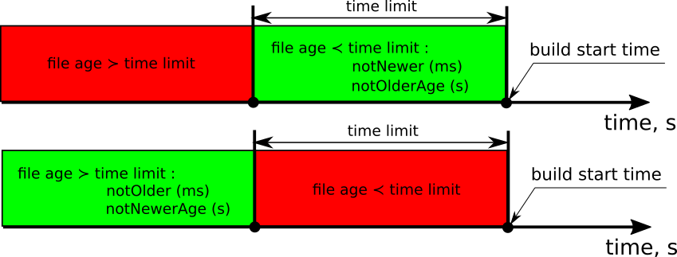

# Фільтри рефлектора

В туторіалі дається класифікація фільтрів рефлектора та показано як вони застосовуються

### <a name="full-form-reflector"></a> Повна форма запису рефлектора  
Запис операції копіювання в скороченій формі зручний, але тоді вибірка елементів проходить лише за іменем файлів. Якщо потрібно точно відібрати файли необхідно записати повну форму рефлектора.  
Запишемо рефлектор копіювання файлів з попереднього прикладу в повній формі:


```yaml
  reflect.copy.:
    recursive: 2
    src:
      filePath:
        .: .
      prefixPath: proto
    dst:
      prefixPath: path::out.*=1
    criterion:
      debug: [ 0,1 ]

```
Трансформація полягає в розділенні ресурсів на джерело для копіювання `src` та місце призначення `dst`, де будуть поміщені скопійовані файли. Поле `filePath` переміщено в ресурси поля `src` та позначає копіювання файлів з однієї кореневої директорії в другу, але обидві директорії кореневі, що пояснюється використанням префіксів директорії `prefixPath`. Для джерела файлів префікс має значення `proto`, а для директорії призначення вибирається за критеріоном з ресурсів секції `path`.

### <a name="configuration"></a> Початкова конфігурація модуля  
Почнемо знайомство з фільтрами з останньої конфігурації системи модифікувавши назви файлів:  

```
.
├── proto
│     ├── proto.two
│     │     └── script.js
│     ├── files
│     │     ├── manual.md
│     │     └── tutorial.md
│     ├── build.js 
│     └── package.json   
│
└── .will.yml       

```

### <a name="reflector-masks"></a> Маски рефлектора
Ґлоби зручні в використанні, але при такій структурі файлів і каталогів доведеться створювати по декілька процедур, щоб вибрати необхідні файли. Ми використаємо функції рефлектора для фільтрування вибірки файлів.  
Почнемо з використання масок операцій - фільтрування файлових операцій за місцем виконання.  
Пакет `willbe` здатен фільтрувати операції в консолі операційної системи (поле `maskTerminal`), в директоріях (поле `maskDirectory`) та одночасно в консолі та директоріях (поле `maskAll`).  
Кожне з зазначених полів вибірково включає ресурси:   
`includeAny` - включити в вибірку будь-який елемент з вказаним параметром;  
`includeAll` - включити в вибірку всі знайдені елементи з вказаним параметром;  
`excludeAny` - виключити з вибірки будь-який елемент з вказаним параметром;  
`excludeAll` - виключити з вибірки всі елементи з вказаним параметром.  
Правила для вибірки формуються з застосуванням регулярних виразів JavaScript для цього в фільтрі маски вказується префікс `!!js/regexp` перед регулярним виразом.   
Якщо при копіюванні у вказаній структурі потрібно включити всі файли з розширенням '.js' та виключити документи з розширенням '.md', то потрібно додати маску в поле `src`:  

```yaml
maskAll:
    excludeAll: 
       - !!js/regexp '/\.md$/'
    includeAll: 
       - !!js/regexp '/\.js$/'


```
 
Повний лістинг файла `.will.yml`:
<details>
  <summary><u>Відкрийте, щоб проглянути</u></summary>

```yaml

about :
  name : maskFilter
  description : "To use reflector filter"
  version : 0.0.1

path :

  in : '.'
  out : 'out'
  proto : './proto'
  out.debug : 
    path : './out/debug'
    criterion :
      debug : 1
  out.release : 
    path : './out/release'
    criterion :
      debug : 0

reflector :

  reflect.copy.:
    recursive: 2
    src:
      filePath:
        .: .
      prefixPath: proto
      maskAll:
        excludeAll: 
           - !!js/regexp '/\.md$/'
        includeAll: 
           - !!js/regexp '/\.js$/'
    dst:
      prefixPath: path::out.*=1
    criterion:
      debug: [ 0,1 ]

step :

  reflect.copy :
    inherit : predefined.reflect
    reflector : reflect.*
    criterion :
       debug : [ 0,1 ]

build :

  copy :
    criterion : 
      default : 1
      debug : [ 0,1 ]
    steps :
      - reflect.*

```
</details>

</br>
Запустимо реліз-побудову (`debug : 0`), та перевіримо структуру файлів:  

```
[user@user ~]$ will .build copy.
...
 Building copy.
   + reflect.copy. reflected 4 files /path_to_file/ : out/release <- proto in 0.390s
  Built copy. in 0.440s

```

```
[user@user ~]$ ls -a out/release/
.  ..  build.js  proto.two

[user@user ~]$ ls -a out/release/proto.two  
.  ..  script.js

``` 

Є розбіжність - ми знайшли два файла і один каталог в директорії `release`, але рефлектор пакета `willbe` враховує і директорію `release` тому всього чотири файла.  

### <a name="time-filters"></a> Фільтри по часу (часові фільтри)  
Крім масок рефлектори здатні фільтрувати файли по часу створення. Для цього в поле `src` вносять спеціальні поля: `notOlder`, `notNewer`, `notOlderAge`, `notNewerAge`:  
`notOlder` - не старше на момент вибірки;  
`notNewer` - не новіше на момент вибірки;  
`notOlderAge` - вік, не старший від встановленого на час проведення процедури;  
`notNewerAge` - вік, не менше від встановленого на час проведення процедури.  
В параметрах полів `notOlder`, `notNewer` вказуються значення в мілісекундах (1 с = 1000 мс), а в полях `notOlderAge` і `notNewerAge` в секундах. Рисунок іллюструє як працюють фільтри. Порівнюється вік файла з встановленим обмеженням.  
  
