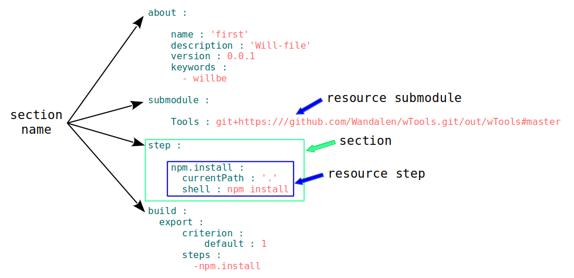

# Configuration <code>willfile</code>

Configuration for describing and building a module. Each formal module has such a file.

For [informal submodules](SubmoduleInformal.md) such a file must be created in order to be comfortable to use.

`willfile`:
- describes [module](Module.md#Module);
- Each module has one or two ( [split](WillFileNamedAndSplit.md#split-willfile) ) `willfiles`;
- Each module can have a maximum of one `out-willfile`;
- `out-willfile` is generated by the utility while the module export;
- consists of sections and resources;
- [section](Structure.md#section-willfile) is the highest structure unit of the `willfile`;
- [resource](Structure.md#Resources) - structural and functional unit of the `willfile`;
- resources describe the module functionality;
- sections combine resources of the same type;
- can be [unnamed or named](WillFileNamedAndSplit.md#Named-willfile);
- for convenience may be [split](WillFileNamedAndSplit.md#Split-willfile) on two physical files;
- may be [generated (`out-willfile`)](WillFileExported.md#exported-willfile-out-willfile) or written manually;
- generated `out-willfile` can be imported, as a submodule;
- Resources can be reused through [inheritance](Inheritance.md).

The following extensions of the `willfile` are supported:
- `.yml`,
- `.json`,
- `.cson`.  

### Example of the module file structure

The figure shows the list of files in the module directory (output command `ls -al`), by the rectangle the `willfile`.
is marked.

### Example of the `willfile`

A structure of the `willfile` and its elements.
