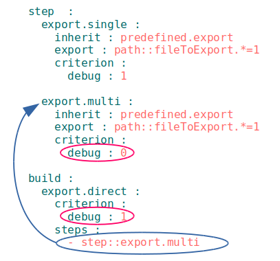

# Критеріон

Елемент порівняння в `will-файлі` для визначення умов використання ресурса.  

Критеріони формують собою асоціативний масив (карту критеріонів) для ресурса, яка зберігає дані у вигляді набору пар ключ-значення, при цьому, масив не містить дві пари з однаковими ключами. Утилiта `willbe` порівнює повністю мапи критеріонів збірки і ресурса, таким чином, доступ до ресурса `will-файла` можливий при співпадінні цих мап.     

### Приклад побудови таблиці істинності
При відладці (`debug`) збірка використовує крок `build.debug`, а при виконанні реліз-побудови (`debug` не виконується), використовується крок `build.release`.  Іншими словами, є один ключ-критеріон (`debug`) та дві кроки, які залежать від його значення. Тоді таблиця істинності має вигляд:  

| Критеріон `debug` | Крок `build.debug` | Крок `build.release` |
|-------------------|--------------------|----------------------|
| 1                 | 1                  | 0                    |
| 0                 | 0                  | 1                    |

Приклад іллюструє вибір на основі одного критеріону, а ресурс може мати довільне число критеріонів для створення унікальних умов доступу до ресурса. Якщо число критеріонів збільшується, то структура таблиці ускладнюється.  

### Використання  
- Для критеріонів прийнято використовувати значення "0" та "1".
- Порівняння мап критеріонів проходить, якщо в посиланні на ресурс використовуються ґлоби, тобто, припускається, що є декілька ресурсів, які входять в вибірку селектора. Простий селектор - прямий вибір ресурса з ігноруванням критеріонів.  
На рисунку крок `export.multi` буде виконано хоча критеріони не співпадають.

  

- Ресурс, в якому відсутній критеріон