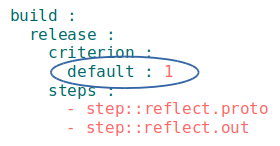
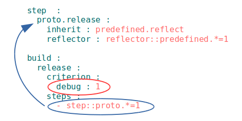

# Критеріон

Елемент порівняння для відбору ресурсів.  

Критеріони формують собою асоціативний масив (карту критеріонів) для ресурса, яка зберігає дані у вигляді набору пар ключ-значення, при цьому, масив не містить дві пари з однаковими ключами. Базова мапа критеріонів побудови задається в збірці. Утилiта `willbe` порівнює мапи критеріонів збірки і ресурса, таким чином, доступ до ресурса `will-файла` можливий при співпадінні цих мап.     

### Приклад побудови таблиці істинності
При відладці (`debug`) збірка використовує крок `build.debug`, а при виконанні реліз-побудови (`debug` не встановлений), використовується крок `build.release`.  Іншими словами, є один ключ-критеріон (`debug`) та дві кроки, які залежать від його значення. Тоді таблиця істинності має вигляд:  

| Критеріон `debug` | Крок `build.debug` | Крок `build.release` |
|-------------------|--------------------|----------------------|
| 1                 | 1                  | 0                    |
| 0                 | 0                  | 1                    |

Приклад іллюструє вибір на основі одного критеріону, а ресурс може мати довільне число критеріонів для створення унікальних умов доступу до ресурса. Якщо число критеріонів збільшується, то структура таблиці ускладнюється.  

### Використання   
- Критеріони можуть мати одиничні і множинні значення. Наприклад

```
debug : 1           # одиничне значення - звичайна форма запису
debug : [ 0,1 ]     # множинне значення - запис в формі массиву, використовується при розгортанні критеріонів

```

[Туторіал про розгортання критеріонів.](../tutorial/WillFileMinimization.md)
- Критеріони можуть мати довільні числові і рядкові значення. Наприклад:  

```
raw : [ one, two, three, four ]
compile : [ 1, 2, 3, 4, 5, 6, 7 ]
name : [ name1, name2, name3 ]

```

- Проста форма запису використовує значення "0" та "1".  
- Критеріон `default` вказується в збірці секції `build`, яка буде виконуватись за замовчуванням.



Для побудови збірки `release` вводиться фраза `will .build` без аргумента.
- В одному `will-файлі` одночасно може бути дві збірки за замовчуванням - для побудови і для експорту.
- Критеріон `export` в поєднанні з критеріоном `default` позначає збірку експорту за замовчуванням. Без критеріона `default`, критеріон `export` - звичайний критеріон утиліти.


- Порівняння мап критеріонів проходить, якщо в посиланні на ресурс використовуються ґлоби, тобто, припускається, що є декілька ресурсів, які входять в вибірку селектора.
- При використанні простого селектора - прямого посилання на ресурс - критеріони ігноруються.  
Вказаний на рисунку крок `export.multi` буде виконано, хоча критеріони не співпадають.

  

- Якщо в мапі критеріонів ресурса не вказаний критеріон-ключ, який є в мапі критеріонів збірки, то ресурс валідує його з будь-яким значенням.



Зазначений крок `proto.release` буде виконаний при будь-якому значенні критеріона `debug` в збірці `release`. Якщо в збірку додати інші критеріони, крок також буде виконано.
