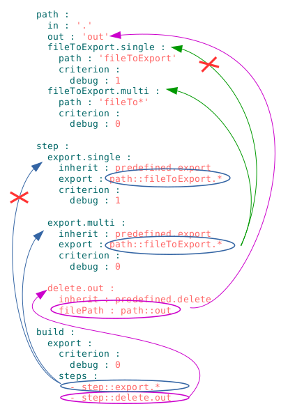
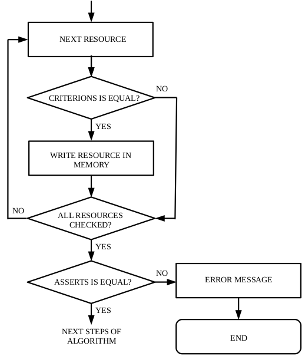
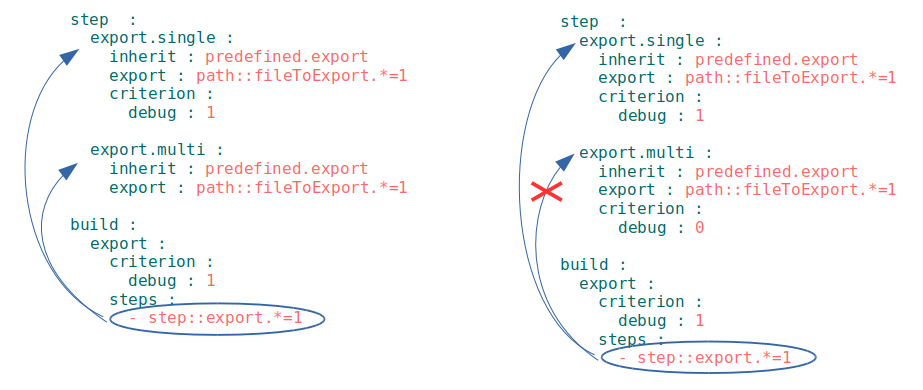

### Селектор

Рядок-посилання на ресурс або декілька ресурсів модуля.

### Селектор з ґлобом

Селектор, який для вибору ресурсу використовує пошукові шаблони - ґлоби.  

[Globbing](https://linuxhint.com/bash_globbing_tutorial/) - представляє собою аналог регулярних виразів  для пошуку файлів в bash-терміналі.  



На рисунку в збірці `build::export` використовується два види селекторів. Селектор `step::export.*` є селектором з ґлобом бо містить `*`, читається: "вибрати всі кроки, які починаються на `export.`". Цей селектро може обрати кроки `step::export.single` i `step::export.multi` (позначено синіми стрілками). Вибір кроку здійснюється [порівнянням мапи критеріонів](Criterions.md) - і співпадає лише один крок `step::export.multi`. Аналогічно здійснюється вибір шляху селектором `path::fileToExport.*` в кроці `step::export.multi`.

Селектори `step::delete.out` в збірці `build::export` і `path::out` в кроці `delete.out` - прості - мають пряме посилання на ресурс.  В `will-файлі` використовуються селектори вигляду `Тип ресурса :: Назва ресурса`.

### Ґлоб з ассертом

Спеціальна синтаксична конструкція, що додається до ґлоба в для обмеження кількості ресурсів, що мають бути знайдені селектором із цим ґлобом.

```yml
path :

  out.debug :
    path : './out/debug'
    criterion :
      debug : 1
  out.release :
    path : './out/release'
    criterion :
      debug : 0

step :

  export :
    export : path::out.*=1
    criterion :
      debug : 0
```

Крок `step::export` повинен вибрати один шлях `path::out.debug`. Так, як це цілком прогнозований і очікуваний результат то ророзбник помістив в селектор `path::out.*=1` асерт `=1`. Це гарантуватиме викидання помилки, якщо та трапиться і за цим селектором буде знайдено більше або менше одного шляху. Наприклад, якщо в шляхах не буде вказано критеріон `debug`, тоді буде знайдено обидва шляхи і асерт викене помилку.

За селектром із ґлобом можливо знайти більше одного або навіть жодного ресурса. Якщо розробникові відомо, скільки селектор із ґлобом має знайти ресурсів, то він може вказати це число в якості асерта в селекторі і при виконанні утиліта помітивши, що прогноз розробника не підтвердився викине помилку. Лишати асерти всюди, де точно відомо, який має бути результат виконання - гарна практика розробки програмного забезпечення. Ґлоб з ассертом - спеціально накладене розробником обмеження на виконання для попередження непередбачуваних наслідків. Якщо ж селектор простий та немає ґлобу то і асерт не потрібен. 

### Алгоритм перевірки асертів в селекторах



Алгоритм виконує перевірку ресурсів на співпадіння [критеріонів](Criterions.md) - при їх співпадінні, утиліта інкрементує лічильник ресурсів. Після перевірки всіх ресурсів значення лічильника порівнюється з встановленим в ассерті. В випадку неспівпадіння значень утиліта видає повідомлення про помилку.  

### Використання ассертів



На рисунку зліва зображено варіант помилкового запису ресурсу. Через [відсутність критеріонів](Criterions.md) в кроці `export.multi` селектор `step::export.*=1` в збірці `build::export` вибере кроки `step::export.single` i `step::export.multi`, що суперечить очікуванню розробника. Завдяки ассерту `=1` помилку буде локалізувано.


Повідомлення про помилку в виборі ресурсів для `will-файла` через спрацювання асерта.  
