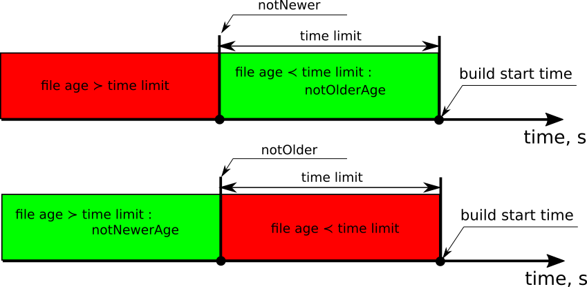

# Часові фільтри рефлектора  

Як користуватись фільтрами відбору файлів по часу.

### Фільтри по часу (часові фільтри)  

Крім [масок](ReflectorMasks.md) та [простих фільтрів](ReflectorFilters.md#Прості-фільтри-рефлектора) рефлектори здатні фільтрувати файли по часу створення (модифікації). Для цього рефлектори використовують часові фільтри:  
- `notOlder` - виключає всі файли, якщо вік принаймні одного файла більше від встановленого ліміту на момент виконання побудови;  
- `notNewer` - виключає всі файли, якщо вік принаймні одного файла менше від встановленого ліміту на момент виконання побудови;
- `notOlderAge` - виключає файли, вік яких більше від встановленого ліміту на момент виконання побудови;  
- `notNewerAge` - виключає файли, вік яких менше від встановленого ліміту на момент виконання побудови.

В параметрах полів `notOlder`, `notNewer`, `notOlderAge` і `notNewerAge` вказуються значення в мілісекундах (1 с = 1000 мс). 

Часові фільтри можна комбінувати між собою, а також з іншими фільтрами. Єдиною умовою є виключення конфліктів між фільтрами.  

### Обмеження вибору файлів за часом

  

Рисунок іллюструє як працюють часові фільтри. Фільтри `notOlderAge` i `notNewerAge` внесені в зелені зони, оскільки вони застосовуються до окремих файлів. Фільтри `notOlder` i `notNewer` позначають часовий ліміт для всіх файлів, тому, графічно вони зображені на межі. 

### Використання часових фільтрів    

<details>
  <summary><u>Структура файлів</u></summary>

```
timeFilters
     ├── proto
     │     ├── proto.two
     │     │     └── script.js
     │     ├── files
     │     │     ├── manual.md
     │     │     └── tutorial.md
     │     ├── build.txt.js
     │     └── package.json  
     └── .will.yml       

```

</details>

Створіть приведену вище структуру файлів для дослідження часових фільтрів.

<details>
  <summary><u>Код файла <code>.will.yml</code></u></summary>

```yaml
about :

  name : timeFilter
  description : "To use reflector time filters"
  version : 0.0.1

path :

  in : '.'
  out : 'out'
  proto : './proto'
  out.debug :
    path : './out/debug'
    criterion :
      debug : 1
  out.release :
    path : './out/release'
    criterion :
      debug : 0

reflector :

  reflect.copy:
    recursive: 2
    src:
      filePath: ./proto
      notNewerAge : 10000
      notOlderAge : 86400000
    dst:
      filePath: path::out.*=1
    criterion:
      debug: [ 0,1 ]

step :

  reflect.copy :
    inherit : files.reflect
    reflector : reflect.*
    criterion :
       debug : [ 0,1 ]

build :

  copy :
    criterion :
      debug : [ 0,1 ]
    steps :
      - reflect.*

```

</details>

Скопіюйте код в файл `.will.yml`. 

В рефлекторі `reflect.copy` використовується наступний часовий діапазон вибірки файлів: `10000/1000 = 10 с`; `86400000/1000 = 86400 c = 1 доба (864000/60/60/24)`. Тобто, вибираються файли які створені в межах від 10 секунд до однієї доби.   

<details>
  <summary><u>Вивід команди <code> will .build copy.debug</code></u></summary>

```
[user@user ~]$ will .build copy.debug
...
  Building copy.debug
   + reflect.copy.debug reflected 8 files /path_to_file/ : out/debug <- proto in 0.390s
  Built copy.debug in 0.432s

```

</details>

Запустіть побудову збірки відладки `will .build copy.debug`. Співставте вивід консолі і приведену структуру файлів після побудови.

<details>
  <summary><u>Структура модуля після побудови</u></summary>

```
timeFilters
     ├── proto
     │     ├── proto.two
     │     │     └── script.js
     │     ├── files
     │     │     ├── manual.md
     │     │     └── tutorial.md
     │     ├── build.txt.js
     │     └── package.json  
     ├── out
     │     └── debug
     │           ├── proto.two
     │           │     └── script.js
     │           ├── files
     │           │     ├── manual.md
     │           │     └── tutorial.md
     │           ├── build.txt.js
     │           └── package.json    
     └── .will.yml       

```

</details>

Всі файли скопійовано адже створена директорія містить нові файли з віком, що входить в вибраний діапазон. 

Змініть діапазон в `notNewerAge` з 10000 до 8000000, щоб виключити можливість копіювання файлів створених для випробування.   

<details>
  <summary><u>Вивід команди <code> will .build copy.</code></u></summary>

```
[user@user ~]$ will .build copy.
...
  Building copy.
   + reflect.copy. reflected 3 files /path_to_file/ : out/release <- proto in 0.311s
  Built copy. in 0.358s

```

</details>

Запустіть реліз-побудову (`will .build copy.`) після внесення змін. 

<details>
  <summary><u>Вивід команди <code>ls -a out/release/</code></u></summary>

```
[user@user ~]$ ls -a out/release/
.  ..  files  proto.two

```

</details>

Перевірте вміст директорії `out/release` командою `ls -a out/release/`. Співставте з приведеним виводом і побудованою структурою файлів.

<details>
  <summary><u>Структура модуля після побудови</u></summary>

```
timeFilters
     ├── proto
     │     ├── proto.two
     │     │     └── script.js
     │     ├── files
     │     │     ├── manual.md
     │     │     └── tutorial.md
     │     ├── build.txt.js
     │     └── package.json  
     ├── out
     │     ├── debug
     │     │     ├── proto.two
     │     │     │     └── script.js
     │     │     ├── files
     │     │     │     ├── manual.md
     │     │     │     └── tutorial.md
     │     │     ├── build.txt.js
     │     │     └── package.json 
     │     └── release
     │           ├── proto.two
     │           └── files
     └── .will.yml       

```

</details>

Після виконання команди скопійовано директорії без файлів, оскільки термінальні файли мають менший вік ніж діапазон вибірки.  

### Часовий фільтр `notOlder`

<details>
  <summary><u>Секція <code>reflector</code> з фільтром <code>notOlder</code></u></summary>

```yaml
reflector :

  reflect.copy.:
    recursive: 2
    src:
      filePath: ./proto
      notOlder : 60000
    dst:
      filePath: path::out.*=1
    criterion:
      debug: [ 0,1 ]

```

</details>

Випробуйте часовий фільтр `notOlder` з встановленим лімітом в одну хвилину. Для цього замініть рефлектор як в приведеному прикладі.  

<details>
  <summary><u>Вивід команди <code>will .build copy.debug</code></u></summary>

```
[user@user ~]$ will .build copy.debug
...
  Building copy.debug
   + reflect.copy. reflected 8 files /path_to_file/ : out/debug <- proto in 0.311s
  Built copy. in 0.358s

```

</details>

Видаліть директорію `out` та запустіть побудову відладки.

<details>
  <summary><u>Структура модуля після побудови</u></summary>

```
timeFilters
     ├── proto
     │     ├── proto.two
     │     │     └── script.js
     │     ├── files
     │     │     ├── manual.md
     │     │     └── tutorial.md
     │     ├── build.txt.js
     │     └── package.json  
     ├── out
     │     └── debug
     │           ├── proto.two
     │           │     └── script.js
     │           ├── files
     │           │     ├── manual.md
     │           │     └── tutorial.md
     │           ├── build.txt.js
     │           └── package.json    
     └── .will.yml       

```

</details>

На момент побудови вік всіх файлів більше однієї хвилини, тому скопійовано всю структуру.

### Підсумок

- Часові фільтри рефлектора формують діапазон вибірки файлів за часом створення (модифікації).  
- Часові фільтри комбінуються з іншими фільтрами рефлектора.  
- Фільтри `notOlder` і `notNewer` здійснюють операцію, якщо всі файли входять в діапазон вибірки, а фільтри `notOlderAge` і `notNewerAge` здійснюють відбір відносно кожного файла.  

[Повернутись до змісту](../README.md#tutorials)
